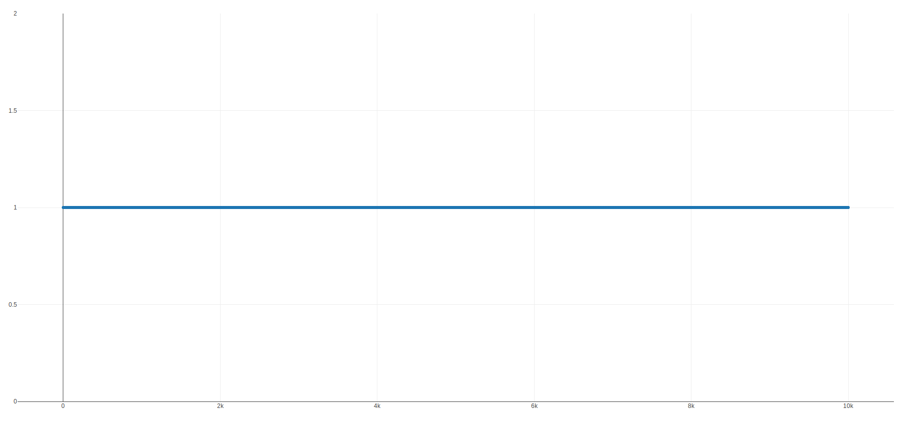

# Générateurs de nombres pseudo-aléatoires

> Le code est disponible à l'adresse suivante :  
https://github.com/Krytexo/prng

## Générateur à congruences linéaires

La création de ce type de générateur en `python` se révèle extrêmement simple. Le code ci-dessous suffit en effet à créer un générateur paramétrable qu'il nous suffira de rappeler en boucle. On exploite la capacité de python à stocker des fonctions dans des variables, ce qui permet de déclarer un générateur avec certains paramètres et de l'appeler ensuite avec d'autres.

```python
def linear_pnrg(a, b, m):
    return lambda k: (a * k + b) % (2 ** m)

prng = linear_pnrg(6, 2, 24)
seed = 5

while(1):
    seed = prng(seed)
```

Afin d'observer le nombre de tours on va vérifier le nombre de valeurs que le générateur est capable de sortir avant de boucler.

```python
# Déclaration du PRNG
prng = linear_pnrg(6, 2, 24)
seed = 5

i = 0
seen = []
# Tant que la valeur de la graine n'a pas déjà été observée :
while(seed not in seen):
    seen.append(seed)
    seed = prng(seed)
    i += 1

print("Nombre de tours : {}".format(i))
```

Ce qui est intéressant avec ces paramètres c'est que le générateur boucle très tôt, **25 tours** uniquement. Mais en remplaçant le six par un trois &ndash; soit un infime changement en apparence : `prng = linear_pnrg(3, 2, 24)` &ndash; le script commence à générer des dizaines de milliers de résultats sans s'arrêter. Toujours pas de résultats pour l'instant. On observe cependant une excellente répartition en arrêtant le générateur à 100000 résultats, ce qui confirme la qualité reconnue de ce type de PRNG pour la répartition de leurs valeurs.


Pourtant, bonne répartition n'est pas synonyme de qualité pour un générateur aléatoire et de nombreuses analyses statistiques sont nécessaires afin de garantir le facteur aléatoire des résultats. Ici, il suffit de regarder le comportement du générateur lorsque toutes les valeurs sont prises modulo 2 (cf. ci-dessous). On se rend compte que le parfait rectangle se transforme en une droite alignée sur 1, en d'autres termes, tous les résultats sont impairs.



Pour la périodicité, courte ou longue, elle est inévitable avec un générateur dont les bornes sont définies. En effet, à partir du moment où l'on travaille dans un ensemble fini, on ne peut observer qu'un nombre fini de résultats possibles. De ce fait, si vous tirez des nombres aléatoirement dans cet ensemble, soit vous les tirez tous, soit vous retombez sur un nombre déjà tiré. Dans les deux cas, le générateur va boucler puisque chaque résultat dépend du précédent. On cherche donc à repousser cette boucle le plus possible afin de pouvoir difficilement prévoir le suivant. Il va de soit qui si le pattern se répète et que l'on a observé la première itération, on est capable de prévoir les valeurs à venir. Le générateur n'est donc plus aléatoire du tout.

## Registre à décalage et rétroaction

Le LFSR (*Linear Feedback Shift Register*) ou *Registre à décalage et rétroaction linéaire* est basé sur un registre de *n* bits que l'on décale à chaque génération. Le nouveau bit est calculé à partir de ceux présents dans le registre, ils forment l'état interne du générateur. Comme expliqué ci dessus, la taille du registre va limiter le nombre de possibilités et donc la période maximale du générateur. Si l'on prend un registre de 30 bits, il existe *2³⁰* combinaisons possibles. Ainsi la période *T* &ndash; soit le nombre de générations possibles avant de retomber sur un résultat déjà généré &ndash; équivaut à *2³⁰ - 1*, soit **1.073741823e+9**. Mais selon la qualité du générateur &ndash; entendus état interne initial et le polynôme de rétroaction &ndash; la boucle peut se révéler beaucoup plus courte.

Pour commencer considérons un registre de 4 bits, avec le polynôme suivant :
<center>*b<sub>n</sub> = b<sub>n-3</sub>* ⊕ *b<sub>n-4</sub>*</center>  
Puisque la période *T<sub>max</sub>* est égale à 15, on peut se permettre dérouler l'algorithme étape par étape. Essayons avec `1111`, puis `0000` :

<div style="width: 100%; background-color: white; padding: 0;">

<div style="display: inline-block; width: 40%; height: 100%; margin: auto 4%;">

</div>
</div>

Dans le premier cas, la quatorzième itération nous permet de retomber sur un résultat déjà vu. On a donc une période presque maximale de 14 au lieu de 15. Dans le deuxième, la première itération nous ramène à l'état interne initial. On dit donc que sa période est de 1.

L'implémentation est relativement simple. La fonction `prng()` ci-dessous est permet la génération de nouveaux nombres à partir de la graine. Pour représenter cette dernière, on utilise une queue (`deque` en Python), qui représente l'implémentation la plus efficace d'une file (FIFO : First In First Out). Celle-ci est intéressante puisqu'elle va permettre de décaler notre état interne à chaque appel de la fonction.

```python
seed = deque([1, 0, 1, 1, 0, 0, 1, 0])
f = lambda q: q[2] ^ q[4] ^ q[7]

def register_prng(f):
	def prng(seed):
		new = f(seed)
		seed.popleft()
		seed.append(new)
		return (int(''.join(map(str, seed)), 2) / pow(2, len(seed)), seed)
	return prng
```

Mais contrairement au premier PRNG, la graine ne peut servir directement de sortie dans cet algorithme. Ainsi, on ne peut pas rappeler la fonction sur elle-même en boucle puisque son entrée (la graine / l'état interne) ne correspond pas à la sortie (le résultat). Cela oblige à réviser l'implémentation en conséquence. Une des solutions serait de passer un `tuple` en entrée &ndash; contenant la graine et le résultat &ndash; qui serait aussi renvoyé en sortie afin de pouvoir rappeler la fonction récursivement. Deuxième solution &ndash; que j'ai mis en place : représenter chaque générateur comme un objet et modifier la graine qui serait alors contenue en attribu de l'objet en question.


# Analyses statistiques

Que déduire des observations réalisables sur ces deux générateurs ? Tout d'abord, que l'un comme l'autre permettent une bonne répartition des résultats. Ensuite que la période du LFSR implémenté est bien plus courte, la faute à la taille restreinte de l'état interne. En effet, les 2⁸ possibilités ne permettent d'obtenir que 256 valeurs différentes, ce qui &ndash; inévitablement &ndash; implique que le générateur bouclera très tôt.

Lorsqu'on observe la répartition du LCG on se rend compte qu'il couvre la quasi-totalité du spectre disponible. On remarque cependant qu'en prenant une graine trop "basse", les premiers résultats forment une suite croissante, presque exponentielle. Mais une fois le modulo atteint, le générateur prend une tout autre tournure avec une répartition très large.


Cependant, comme cela a été exposé ci-dessus, si l'on prend les résultats modulo 2, on se rend vite compte que tous les résultats sont impairs.


Le LFSR se comporte différemment puisque l'on peut observer la répétition d'un pattern dans la génération. Si l'amplitude est bien couverte (sur l'axe Y), la boucle sur X est très visible.


Contrairement au LCG, prendre les résultats modulo 2 ne révèle aucun travers particulier dans la génération. La seule chose que l'on peut observer sur le graphique ci-dessous reste le pattern qui se répète, à l'image de ce que l'on vient d'observer.


Jouer sur les paramètres permet de faire varier plusieurs caractéristiques des résultats. La période, tout d'abord, à l'image de ce que l'on avait observer dans la première partie, mais aussi la manière de couvrir l'amplitude disponible. Ainsi, on remarque par exemple que la suite observée au début des résultats du LCG peut tout à fait disparaître si l'on fait augmenter le pas entre chaque résultat. On atteint ainsi la limite imposée par le modulo beaucoup plus tôt, ce qui fait disparaître cette figure. Modifier la formule du LFSR permet aussi de modifier le pattern de répétition et ainsi peut-être de le rendre plus intéressant &ndash; bien que le LFSR ne prenne tout son sens que combiné.
